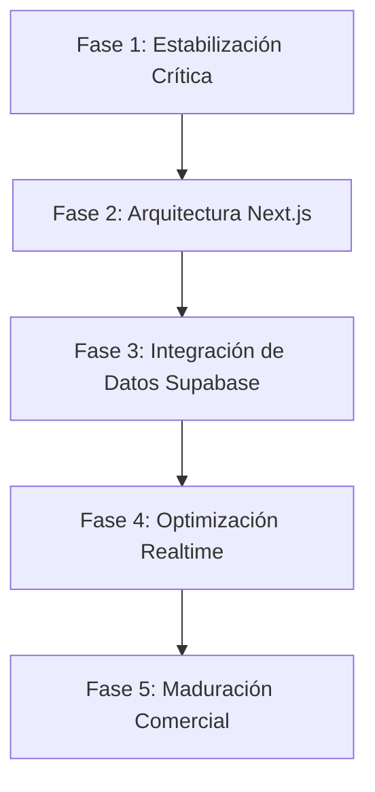

# AUD-MAP-001 — Hoja de Ruta de Mejora (Improvement Roadmap)

---

## 1. Planificación de Fases para JATapp Demo v2
La transición e implementación del sistema logístico a producción se organizará en cinco fases de desarrollo ordenadas cronológicamente.

---

### Fase 1: Estabilización Crítica y Modelado de Datos
*   **Objetivo:** Crear el esquema Postgres en Supabase e inicializar el repositorio Next.js + TypeScript.
*   **Entregables:**
    *   Migraciones SQL en Supabase.
    *   Definición estricta de interfaces TypeScript para el proyecto.
    *   Pruebas de conectividad inicial local-Supabase.

---

### Fase 2: Desarrollo Arquitectónico (React Components)
*   **Objetivo:** Traducir los maquetados HTML5 del prototipo a componentes reactivos de React y estilos responsivos mediante Tailwind CSS.
*   **Entregables:**
    *   Dashboard ejecutivo interactivo.
    *   Tablero de control Kanban modularizado.
    *   Formularios y modales de asignación validados con `react-hook-form`.

---

### Fase 3: Integración de Supabase Auth & RLS
*   **Objetivo:** Bloquear los portales y restringir el acceso a datos según el rol mediante políticas criptográficas RLS.
*   **Entregables:**
    *   Login y restablecimiento de contraseña integrado a Supabase Auth.
    *   Políticas RLS aplicadas sobre tablas `rides` e `organizations`.
    *   Pruebas automatizadas de denegación de privilegios no autorizados.

---

### Fase 4: Optimización Realtime (WebSockets)
*   **Objetivo:** Sustituir la sincronización por localStorage por canales de escucha directa sobre la réplica de Postgres.
*   **Entregables:**
    *   Sincronización instantánea de traslados en curso y cambios de tarifa.
    *   Feed de notificaciones de despachador interactivo.
    *   Mapa de choferes dinámico integrado mediante Leaflet/OpenStreetMap.

---

### Fase 5: Maduración y Readiness Comercial
*   **Objetivo:** Optimización de carga, pulido estético en móviles y despliegue final en subdominio de producción.
*   **Entregables:**
    *   Estrategias de lazy loading aplicadas sobre mapas.
    *   Auditoría de seguridad (conforme a [RB-002](../RUNBOOKS/RB-002_PUBLIC_REPOSITORY_SECURITY_CHECKLIST.md)).
    *   Despliegue final exitoso verificado en Vercel.

---

### Navegación
*   **Volver al índice:** [Volver al índice](AUDIT_JATAPP_DEMO_V2.md)
