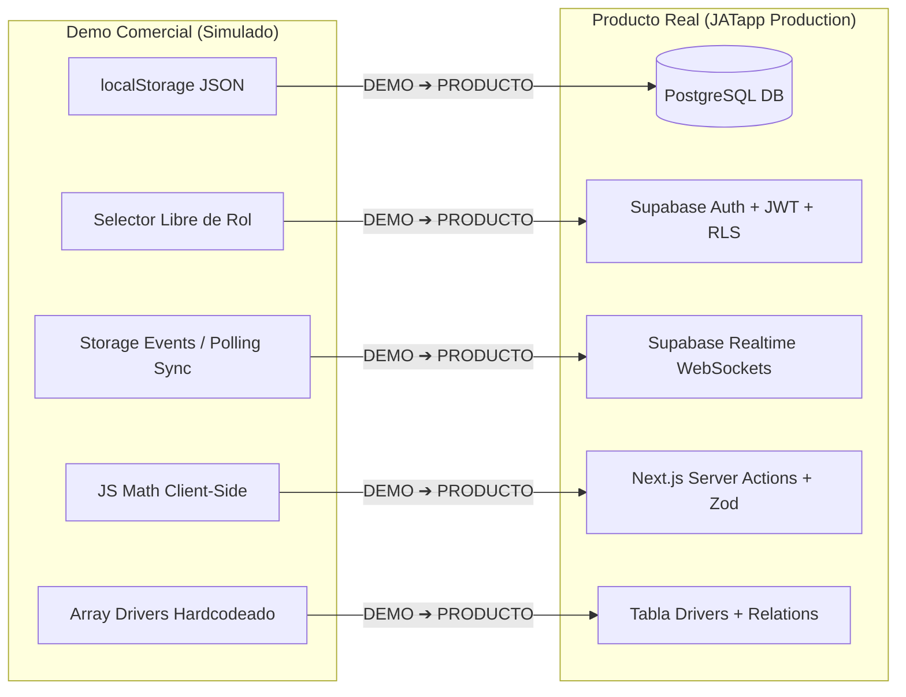
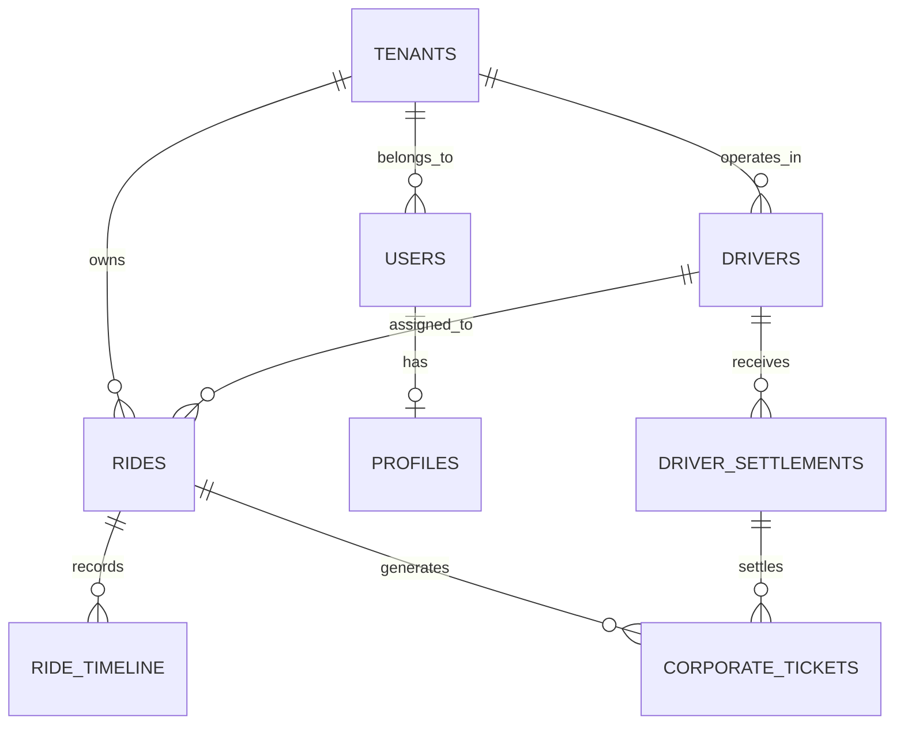
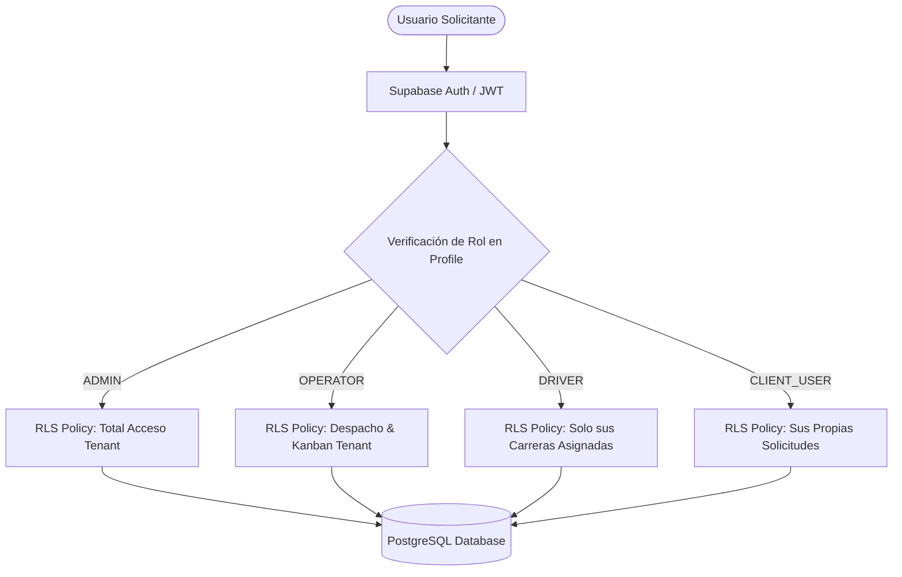
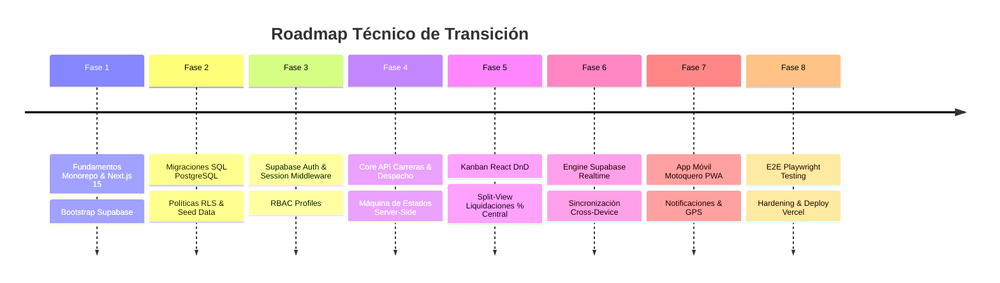

# PROD-ASSESS-001 — Evaluación Técnica de Transición: Demo Comercial ➔ Producto Real (JATapp)

> [!IMPORTANT]
> **Documento de Referencia Oficial de Producto**  
> La Demo Comercial de JATapp ha sido oficialmente aprobada por los stakeholders y la dirección operativa. Este documento constituye el punto de partida técnico formal para congelar el desarrollo del prototipo de demostración e iniciar la construcción del producto real de producción sobre una arquitectura escalable, segura y multi-tenant con **Next.js 15**, **TypeScript**, **Tailwind CSS** y **Supabase (PostgreSQL + RLS + Realtime)**.

---

## 1. Estado Real del Demo

Para evitar asumir la existencia de capacidades no implementadas, se ha realizado una inspección exhaustiva línea por línea del repositorio actual (`apps/jat-demo/index.html`, `apps/jat-demo/app.js`, `apps/jat-demo/styles.css`, `api/sync.js` y `vercel.json`).

### 1.1 Diagnóstico de Arquitectura e Infraestructura Actual

*   **Arquitectura:** Single Page Application (SPA) plana desarrollada en Vanilla JavaScript (ES6+), HTML5 semántico y CSS3 nativo. No utiliza empaquetadores (*bundlers* como Vite o Webpack) ni transpiladores.
*   **Servidor Backend / Sync:** Prototipo serverless en Vercel (`api/sync.js`) que almacena sesiones de sincronización temporal en una instancia de `Map()` en memoria de proceso (proceso volátil).
*   **Estructura de Carpetas:**
    ```
    JATapp/
    ├── api/
    │   └── sync.js                # Function Serverless Vercel (Polling in-memory workaround)
    ├── apps/
    │   └── jat-demo/              # Prototipo comercial autocontenido
    │       ├── index.html         # Maquetación monolítica de vistas y modales
    │       ├── app.js             # Lógica monolítica (1,976 líneas JS Vanilla)
    │       └── styles.css         # Sistema de diseño estático CSS (Variables & Glassmorphism)
    ├── docs/                      # Documentación del proyecto (Constitution, Audits, Runbooks)
    └── vercel.json                # Configuración de rutas y rewrites de Vercel
    ```
*   **Dependencias Externas Client-Side:**
    *   Google Fonts (*Inter* y *Outfit* via CDN).
    *   FontAwesome 6.4.0 (Iconografía via CDN).

---

### 1.2 Matriz de Clasificación de Funcionalidades

A continuación se distingue rigurosamente el estado real de cada característica del demo:

| Funcionalidad / Módulo | Estado Real | Descripción Técnica Actual |
|---|---|---|
| **Renderizado Dinámico de Vistas** | `IMPLEMENTADO` | Manipulación directa del DOM (`innerHTML`, `classList`) al cambiar de pestaña. |
| **Selector de Roles en Vivo** | `IMPLEMENTADO` | Overlay modal que cambia la variable `activeRole` (`admin`, `operator`, `motoquero`) sin pedir clave. |
| **Tablero Kanban de Operaciones** | `IMPLEMENTADO` | Visualización en 4 columnas con eventos Drag & Drop (`dragstart`, `dragover`, `drop`) y botones directos. |
| **Asignación de Motoquero** | `IMPLEMENTADO` | Modal selector de choferes con actualización de tarjeta e historial. |
| **Cálculo de Tarifa Dinámica** | `IMPLEMENTADO` | Lógica JS client-side que suma tarifa base, minutos de espera computados y ajustes. |
| **Sincronización Multiventana (Mapeo Local)** | `IMPLEMENTADO` | Bus de eventos usando `window.addEventListener('storage')` para replicar cambios entre pestañas del mismo navegador. |
| **Sincronización Celular (Polling Cloud)** | `SIMULADO` | Polling periódico (`setInterval`) vía `fetch` a `api/sync.js` pasando un `syncId`. |
| **Liquidación Split-View de Motoqueros** | `IMPLEMENTADO` | Panel con menú lateral de 15 conductores, detalle de balance, desglose por pago, Porcentaje de Central editable y cancelación de tickets. |
| **Historial / Timeline Audit por Carrera** | `IMPLEMENTADO` | Array de eventos cronológicos adjunto a cada objeto de carrera. |
| **Persistencia de Datos** | `SIMULADO` | Grabación y lectura del objeto completo `state` serializado en `localStorage.getItem('jatapp_demo_state')`. |
| **Autenticación & Sesiones** | `SIMULADO` | Cambio de perfil inmediato sin verificación de credenciales, passwords ni tokens JWT. |
| **Contadores de Tiempo en Vivo** | `SIMULADO` | `setInterval` local que incrementa minutos de espera en cliente. |
| **Multi-tenancy Corporativo** | `DOCUMENTADO PERO NO IMPLEMENTADO` | Mencionado en [02_PROJECT_SCOPE.md](file:///D:/Antigravity%20Projects/workspace/JATapp/docs/PROJECT_BIBLE/02_PROJECT_SCOPE.md) pero en el demo es solo una string `"company": "Farmacorp S.A."`. |
| **Integración con Pasarelas de Pago** | `DOCUMENTADO PERO NO IMPLEMENTADO` | No existen conectores con APIs bancarias ni pasarelas QR reales. |
| **Notificaciones Push a Dispositivos Móviles** | `DOCUMENTADO PERO NO IMPLEMENTADO` | No hay servicio Firebase Cloud Messaging (FCM) ni Service Workers WebPush. |
| **Base de Datos Relacional SQL** | `NO EXISTE` | No existe esquema PostgreSQL, migraciones ni ORM activo. |
| **Row Level Security (RLS)** | `NO EXISTE` | No existen reglas de autorización ni políticas a nivel de fila. |
| **Servicios Backend / Server Actions** | `NO EXISTE` | No existe API REST ni Server Actions tipadas para validación de datos. |

---

## 2. Elementos Aprobados que Deben Conservarse

Los siguientes componentes representaban el valor diferencial de la Demo Comercial aprobada por los clientes/stakeholders (Fabiana Pérez y equipo operativo). **Deben preservarse en UX y comportamiento funcional**, convirtiéndose en módulos reales del producto:

1.  **Ciclo de Vida y Flujo de Estados de las Carreras:**
    *   `Pendiente` $\rightarrow$ `Asignado` $\rightarrow$ `En Camino` $\rightarrow$ `Completado` (con opción de `Cancelado`).
2.  **Asignación de Motoquero:**
    *   Asignación manual rápida mediante Modal con lista de choferes (mostrando zona, vehículo y rating).
    *   Asignación ágil arrastrando tarjetas en el tablero Kanban desde *Pendiente* hacia *Asignado* (solicitando la selección del motoquero).
3.  **Inicio y Cierre de Servicio:**
    *   Transición simple del estado a *En Camino* (arrastre o botón) y cierre definitivo al llegar al destino.
4.  **Estructura de Tarifas y Recargos:**
    *   Tarifa base configurable por zona/carrera.
    *   Cálculo de minutos de espera computable y adición de ajustes extraordinarios.
5.  **Modalidades de Pago Soportadas:**
    *   Efectivo.
    *   QR Bancario / Transferencia.
    *   Ticket / Vale Corporativo.
6.  **Tablero Kanban Operativo:**
    *   Visualización simultánea de servicios en columnas claras con contadores dinámicos.
7.  **Dashboard Ejecutivo de Monitoreo:**
    *   Tarjetas de KPIs estratégicos: Total Recaudado, Carreras del Día, Chóferes Activos y Ratio de Cumplimiento.
8.  **Gestión de Clientes Corporativos:**
    *   Vincular cada carrera a la empresa solicitante (ej. Farmacorp S.A.) y nombre de la persona que pide el servicio.
9.  **Panel de Flota de Motoqueros:**
    *   Lista de conductores identificados por Número de Móvil (ej. Móvil 1, Móvil 2... Móvil 15), nombre, foto/avatar, placa de motocicleta y zona asignada.
10. **Módulo de Liquidación Financiera Split-View (Administrador):**
    *   Menú lateral izquierdo con tarjetas resumidas de choferes (Avatar, Móvil, Viajes y Bs. Brutos).
    *   Panel derecho con el balance detallado del chofer seleccionado.
    *   Desglose exacto de recaudación por método de pago (Efectivo, QR, Ticket).
    *   Porcentaje de Comisión de Central editable en tiempo real (porcentaje asignado a Fabiana por uso de la central).
    *   Tabla de Tickets/Vales con botón de cancelación o marcado de pago individual.
11. **Timeline Audit de la Carrera (Trazabilidad):**
    *   Historial de hitos cronológicos con hora exacta y acción registrada.
12. **Navegación e Identidad Visual (Patrones UX):**
    *   Sidebar responsivo con cambio de contexto de usuario.
    *   Sistema de diseño Dark Mode premium con acentos en amarillo corporativo (`#FDDE12`), fuentes *Outfit* e *Inter*.
    *   Toasts de notificación flotantes y modales explicativos de ayuda ("¿Qué es esto?").

---

## 3. Elementos que Deben Reemplazarse (DEMO ➔ PRODUCTO)

A continuación se define la matriz explícita de migración técnica. Todo mecanismo de simulación del demo debe ser reemplazado por infraestructura de producción:



### Tabla de Reemplazo Técnico

| Componente Demo | Implementación en Demo | Implementación en Producto Real | Razón Técnica y de Negocio |
|---|---|---|---|
| **Persistencia de Datos** | `localStorage` (`jatapp_demo_state`) | **PostgreSQL** (Supabase Database) | Garantizar persistencia permanente, integridad referencial SQL, concurrencia ACID y backup automático. |
| **Autenticación & Sesiones** | Selector desplegable de roles sin clave | **Supabase Auth** (JWT, Cookies de Sesión Seguras, Magic Links) | Impedir la suplantación de identidad, proteger endpoints y auditar legalmente a los usuarios. |
| **Autorización y Permisos** | `if (activeRole === 'admin')` en JS | **Row Level Security (RLS)** en Postgres + RBAC Middleware | La seguridad debe ser forzada por el motor de BD, no delegada a la vista del navegador. |
| **Sincronización Realtime** | Bus `storage` + Polling HTTP a `api/sync.js` | **Supabase Realtime** (WebSockets Channels) | Sincronización instantánea PC-Móvil con latencia < 50ms sin sobrecargar servidores con polling. |
| **Lógica Financiera / Tarifas** | Funciones JS locales (`app.js`) | **Server Actions / Next.js API Routes** + Validadores **Zod** | Prevenir ataques XSS o manipulación del DOM que permitan alterar precios o comisiones. |
| **Multi-tenancy** | Campo literal string | **Tabla `tenants` + Columna `tenant_id`** con aislamiento RLS | Garantizar que una empresa cliente jamás pueda ver datos de otra central o cliente. |
| **Liquidación de Tickets** | Modificación local de variables en memoria | **Transacciones SQL** (`BEGIN/COMMIT`) en Postgres | Garantizar que el pago de un ticket se liquide contablemente de forma atómica e irreversible. |
| **Estructura del Código** | Monolito JS (`app.js` 1,976 líneas) | **Next.js 15 Monorepo** (React 19 + TypeScript + Modules) | Mantener código limpio, desacoplado, mantenible y fuertemente tipado. |

---

## 4. Arquitectura Objetivo del Producto Real

Para el desarrollo de **JATapp Producto Real**, se establece una arquitectura basada en **Next.js 15 (App Router)**, **TypeScript**, **Tailwind CSS** y el backend BaaS de **Supabase** alojado en la infraestructura global de **Vercel**.

```
apps/
└── jat-app/                       # Aplicación Principal Unificada (Next.js 15 App Router)
    ├── app/
    │   ├── (auth)/
    │   │   ├── login/             # Pantalla de inicio de sesión segura
    │   │   └── layout.tsx
    │   ├── (dashboard)/
    │   │   ├── admin/             # Módulo de Administración & Liquidación Split-View
    │   │   ├── operations/        # Centro de Operaciones & Tablero Kanban Realtime
    │   │   ├── driver/            # PWA / Vista Móvil del Motoquero
    │   │   └── layout.tsx         # Sidebar responsivo + Topbar + Auth Protection
    │   └── api/                   # Webhooks y Server Actions
    ├── components/
    │   ├── ui/                    # Componentes base (Buttons, Modals, Badges, Toasts)
    │   ├── kanban/                # Kanban DnD modularizado
    │   └── settlements/           # Módulo Split-View de liquidación de choferes
    ├── lib/
    │   ├── supabase/              # Clientes de Supabase (Browser, Server, Admin)
    │   ├── services/              # Capa de servicios de dominio (Rides, Drivers, Billing)
    │   └── validators/            # Esquemas de validación Zod
    └── types/                     # Definiciones TypeScript autogeneradas desde Postgres
```

---

### 4.1 Clasificación del Código Actual (Reuse / Refactor / Rebuild / Remove)

| Área / Artefacto | Clasificación | Plan de Acción Técnico |
|---|---|---|
| **Diseño Visual & CSS** (`styles.css`) | `REUSE` | Conservar la paleta de colores (Dark Mode, `#FDDE12`), variables CSS y estética Glassmorphism adaptándolos a Tailwind CSS / CSS Modules. |
| **Estructura HTML / Layouts** | `REUSE` / `REFACTOR` | Convertir el layout del Sidebar, Topbar y Estructura de Modales en Componentes React reutilizables (`JSX/TSX`). |
| **Módulo Kanban & Drag & Drop** | `REFACTOR` | Reactivar el Kanban dentro de React usando `@dnd-kit/core` o handlers HTML5 nativos vinculados a Server Actions. |
| **Módulo Split-View Liquidación** | `REFACTOR` | Modularizar las tarjetas de la izquierda y la vista de detalle de la derecha en componentes React fuertemente tipados. |
| **Lógica de Estado (`app.js`)** | `REBUILD` | Desmontar completamente las 1,976 líneas de `app.js`. Reconstruir la lógica mediante React State (`Zustand`), Server Actions y Hooks de Supabase. |
| **Capa de Persistencia & Auth** | `REBUILD` | Crear esquema SQL de Postgres, triggers de auditoría, políticas RLS y conectar Supabase Auth. |
| **Backend de Sync (`api/sync.js`)** | `REMOVE` | Eliminar por completo la Vercel Function en memoria. |
| **Mecanismo `localStorage`** | `REMOVE` | Eliminar toda lectura/escritura en `localStorage` para estado de negocio. |
| **Selector Libre de Roles** | `REMOVE` | Reemplazar por un flujo de autenticación formal con login y verificación JWT por RLS. |

---

## 5. Modelo de Datos Relacional (PostgreSQL / Supabase)

Se define la estructura de tablas para PostgreSQL. Garantiza integridad referencial, soporte multi-tenant y auditoría contable:



---

### 5.1 Definición de Tablas Principales

#### 1. `tenants` (Empresas Centrales / Clientes Corporativos)
```sql
CREATE TABLE public.tenants (
    id UUID PRIMARY KEY DEFAULT gen_random_uuid(),
    name VARCHAR(255) NOT NULL,
    tax_id VARCHAR(50),
    contact_email VARCHAR(255),
    status VARCHAR(50) DEFAULT 'active' CHECK (status IN ('active', 'suspended', 'inactive')),
    created_at TIMESTAMPTZ DEFAULT now() NOT NULL
);
```

#### 2. `profiles` (Perfiles de Usuario vinculados a `auth.users`)
```sql
CREATE TABLE public.profiles (
    id UUID PRIMARY KEY REFERENCES auth.users(id) ON DELETE CASCADE,
    tenant_id UUID REFERENCES public.tenants(id) ON DELETE CASCADE,
    full_name VARCHAR(255) NOT NULL,
    phone VARCHAR(50),
    role VARCHAR(50) NOT NULL CHECK (role IN ('ADMIN', 'OPERATOR', 'DRIVER', 'CLIENT_USER')),
    avatar_url TEXT,
    created_at TIMESTAMPTZ DEFAULT now() NOT NULL
);
```

#### 3. `drivers` (Flota de Motoqueros)
```sql
CREATE TABLE public.drivers (
    id UUID PRIMARY KEY DEFAULT gen_random_uuid(),
    tenant_id UUID REFERENCES public.tenants(id) ON DELETE CASCADE,
    profile_id UUID REFERENCES public.profiles(id) ON DELETE SET NULL,
    movil_number INT NOT NULL,
    vehicle_type VARCHAR(100) NOT NULL,
    vehicle_plate VARCHAR(50) NOT NULL,
    zone VARCHAR(100) NOT NULL,
    rating NUMERIC(3,2) DEFAULT 5.00,
    status VARCHAR(50) DEFAULT 'available' CHECK (status IN ('available', 'busy', 'offline')),
    created_at TIMESTAMPTZ DEFAULT now() NOT NULL,
    CONSTRAINT unique_movil_per_tenant UNIQUE (tenant_id, movil_number)
);
```

#### 4. `rides` (Carreras / Servicios Express)
```sql
CREATE TABLE public.rides (
    id UUID PRIMARY KEY DEFAULT gen_random_uuid(),
    ride_code VARCHAR(50) UNIQUE NOT NULL, -- ej. RIDE-101
    tenant_id UUID REFERENCES public.tenants(id) ON DELETE CASCADE NOT NULL,
    requester_company VARCHAR(255) NOT NULL,
    requester_person VARCHAR(255) NOT NULL,
    pickup_address TEXT NOT NULL,
    destination_address TEXT NOT NULL,
    initial_fare NUMERIC(10,2) NOT NULL DEFAULT 0.00,
    wait_time_minutes INT DEFAULT 0,
    wait_time_cost NUMERIC(10,2) DEFAULT 0.00,
    total_fare NUMERIC(10,2) NOT NULL DEFAULT 0.00,
    status VARCHAR(50) DEFAULT 'pending' CHECK (status IN ('pending', 'assigned', 'ontheway', 'completed', 'cancelled')),
    priority VARCHAR(50) DEFAULT 'high' CHECK (priority IN ('low', 'medium', 'high', 'urgent')),
    driver_id UUID REFERENCES public.drivers(id) ON DELETE SET NULL,
    payment_method VARCHAR(50) CHECK (payment_method IN ('Efectivo', 'QR', 'Ticket')),
    observations TEXT,
    created_by UUID REFERENCES public.profiles(id),
    created_at TIMESTAMPTZ DEFAULT now() NOT NULL,
    updated_at TIMESTAMPTZ DEFAULT now() NOT NULL
);
```

#### 5. `ride_timeline` (Trazabilidad / Auditoría del Servicio)
```sql
CREATE TABLE public.ride_timeline (
    id UUID PRIMARY KEY DEFAULT gen_random_uuid(),
    ride_id UUID REFERENCES public.rides(id) ON DELETE CASCADE NOT NULL,
    status_from VARCHAR(50),
    status_to VARCHAR(50) NOT NULL,
    event_title VARCHAR(255) NOT NULL,
    event_description TEXT,
    actor_id UUID REFERENCES public.profiles(id),
    created_at TIMESTAMPTZ DEFAULT now() NOT NULL
);
```

#### 6. `corporate_tickets` (Vales y Tickets por Carrera)
```sql
CREATE TABLE public.corporate_tickets (
    id UUID PRIMARY KEY DEFAULT gen_random_uuid(),
    ride_id UUID REFERENCES public.rides(id) ON DELETE CASCADE NOT NULL,
    tenant_id UUID REFERENCES public.tenants(id) ON DELETE CASCADE NOT NULL,
    driver_id UUID REFERENCES public.drivers(id) ON DELETE CASCADE NOT NULL,
    amount NUMERIC(10,2) NOT NULL,
    ticket_code VARCHAR(100) NOT NULL,
    status VARCHAR(50) DEFAULT 'pending' CHECK (status IN ('pending', 'settled', 'cancelled')),
    settlement_id UUID, -- Foreign key posterior a driver_settlements
    created_at TIMESTAMPTZ DEFAULT now() NOT NULL
);
```

#### 7. `driver_settlements` (Liquidaciones Financieras de Motoqueros)
```sql
CREATE TABLE public.driver_settlements (
    id UUID PRIMARY KEY DEFAULT gen_random_uuid(),
    tenant_id UUID REFERENCES public.tenants(id) ON DELETE CASCADE NOT NULL,
    driver_id UUID REFERENCES public.drivers(id) ON DELETE CASCADE NOT NULL,
    period_start TIMESTAMPTZ NOT NULL,
    period_end TIMESTAMPTZ NOT NULL,
    total_rides INT NOT NULL DEFAULT 0,
    gross_amount NUMERIC(10,2) NOT NULL DEFAULT 0.00,
    central_commission_pct NUMERIC(5,2) NOT NULL DEFAULT 20.00, -- % editable de Fabiana
    central_commission_amount NUMERIC(10,2) NOT NULL DEFAULT 0.00,
    driver_payout_amount NUMERIC(10,2) NOT NULL DEFAULT 0.00,
    status VARCHAR(50) DEFAULT 'completed' CHECK (status IN ('draft', 'completed', 'voided')),
    settled_by UUID REFERENCES public.profiles(id),
    created_at TIMESTAMPTZ DEFAULT now() NOT NULL
);
```

---

## 6. Seguridad & Control de Accesos

Se implementará la estrategia de seguridad recomendada en [SECURITY_ASSESSMENT.md](file:///D:/Antigravity%20Projects/workspace/JATapp/docs/AUDITS/SECURITY_ASSESSMENT.md):



### 6.1 Políticas de Row Level Security (RLS) en Postgres

1.  **Aislamiento de Tenant (Multi-Tenancy):**
    ```sql
    ALTER TABLE public.rides ENABLE ROW LEVEL SECURITY;
    
    CREATE POLICY tenant_isolation_policy ON public.rides
        FOR ALL
        USING (tenant_id = (SELECT tenant_id FROM public.profiles WHERE id = auth.uid()));
    ```
2.  **Restricción del Motoquero:**
    ```sql
    CREATE POLICY driver_ride_access ON public.rides
        FOR SELECT
        USING (
            driver_id IN (SELECT id FROM public.drivers WHERE profile_id = auth.uid())
            OR status = 'pending'
        );
    ```

---

## 7. Roadmap de Implementación por Dependencias

Priorizado strictly según dependencias técnicas fundamentales (no por impacto estético):



---

### Detalle de Fases de Desarrollo

#### **Fase 1: Fundamentos del Proyecto & Setup de Infraestructura**
*   **Objetivo:** Crear el proyecto Next.js 15 TypeScript e inicializar la infraestructura en Supabase.
*   **Funcionalidades:** Configuración del proyecto, variables de entorno, cliente de Supabase y tipado base.
*   **Dependencias:** Ninguna.
*   **Criterio de Finalización:** Compilación limpia de Next.js (`npm run build`) y conexión exitosa con Supabase.

#### **Fase 2: Modelo de Persistencia & Migraciones Postgres**
*   **Objetivo:** Ejecutar las DDLs de las 7 tablas principales en Supabase Postgres con RLS y Seeding.
*   **Funcionalidades:** Migraciones SQL de Alembic/Supabase CLI, Triggers de `updated_at` y datos iniciales de prueba.
*   **Dependencias:** Fase 1.
*   **Criterio de Finalización:** Tablas creadas en Supabase con políticas RLS activas y test de inserción SQL.

#### **Fase 3: Autenticación, Usuarios y RBAC**
*   **Objetivo:** Reemplazar el selector de roles simulado por autenticación real mediante JWT.
*   **Funcionalidades:** Pantalla de Login, middleware de Server Router de Next.js, sincronización de `auth.users` con `public.profiles`.
*   **Dependencias:** Fase 2.
*   **Criterio de Finalización:** Inicio de sesión funcional para Fabiana (Admin), Operador y Motoquero dirigiendo a su layout correspondiente.

#### **Fase 4: Dominio de Flota y Operaciones de Despacho**
*   **Objetivo:** Construir los servicios backend para creación, asignación y cambio de estados de carreras.
*   **Funcionalidades:** Server Actions para solicitudes de viaje, asignación de chóferes e inserción en `ride_timeline`.
*   **Dependencias:** Fase 3.
*   **Criterio de Finalización:** API/Server Actions capaces de ejecutar el ciclo completo de carrera respaldado en Postgres.

#### **Fase 5: Interfaz Kanban & Liquidaciones Financieras**
*   **Objetivo:** Reconstruir las vistas principales del producto en componentes React tipados.
*   **Funcionalidades:** Tablero Kanban con Drag & Drop y Módulo Split-View de Liquidación con porcentaje de comisión de central editable y marcado de vales/tickets.
*   **Dependencias:** Fase 4.
*   **Criterio de Finalización:** Interfaz gráfica lista que opera 100% sobre datos de PostgreSQL sin tocar `localStorage`.

#### **Fase 6: Realtime Engine & Sincronización Multi-Dispositivo**
*   **Objetivo:** Conectar las suscripciones WebSockets de Supabase Realtime a las tablas `rides` y `drivers`.
*   **Funcionalidades:** Actualización instantánea en pantalla al mover una tarjeta en el celular o PC sin necesidad de recargar.
*   **Dependencias:** Fase 5.
*   **Criterio de Finalización:** Un cambio de estado en la PC se refleja en < 100ms en la pantalla del celular.

#### **Fase 7: Experiencia Móvil de Motoquero (PWA)**
*   **Objetivo:** Optimizar la vista del conductor para dispositivos móviles.
*   **Funcionalidades:** Interfaz touch-friendly, manifest PWA, botones táctiles gigantes de "Iniciar Carrera" y "Completar".
*   **Dependencias:** Fase 6.
*   **Criterio de Finalización:** Instalación como PWA en teléfonos Android/iOS con funcionalidad completa en ruta.

#### **Fase 8: Hardening de Producción & Despliegue en Vercel**
*   **Objetivo:** Preparar el sistema para uso comercial real de alta disponibilidad.
*   **Funcionalidades:** Pruebas E2E automatizadas, revisión de seguridad RLS, optimización de bundles y despliegue a dominio de producción.
*   **Dependencias:** Fase 7.
*   **Criterio de Finalización:** Suite E2E aprobada al 100% y despliegue en Vercel sin errores.

---

## 8. Deuda del Demo ("NO LLEVAR AL PRODUCTO")

Para proteger la calidad arquitectónica del producto final, **se prohíbe explícitamente llevar los siguientes patrones del demo a la base de código de producción**:

> [!CAUTION]
> ### LISTA NEGRA DE PATRONES A ELIMINAR (NO LLEVAR AL PRODUCTO)
> 1.  **Persistencia en Monolito JSON Local:** `localStorage.setItem('jatapp_demo_state', ...)` debe ser erradicado por completo.
> 2.  **Bus de Eventos por Storage Browser Event:** `window.addEventListener('storage', ...)` para sincronizar ventanas.
> 3.  **Servidor Polling en Memoria de Proceso:** `api/sync.js` que guarde estado en un `Map()` serverless.
> 4.  **Cambio de Rol sin Credenciales:** Selector visual de perfiles sin pedir clave ni validar un JWT.
> 5.  **Identificadores Hardcodeados en Arrays JS:** Arrays en memoria como `DEFAULT_STATE` con listas fijas de choferes o viajes.
> 6.  **Temporizadores Locales de Negocio:** `setInterval` en JavaScript del navegador para sumar minutos de tiempo de espera.
> 7.  **Cálculos de Tarifa y Liquidación Exclusivos del Cliente:** Lógica financiera ejecutada en el DOM que no sea re-validada en el backend.
> 8.  **Inyección HTML Directa mediante Interpolación de Strings:** `element.innerHTML = \`...\`` desprotegida contra ataques de XSS.
> 9.  **Monolito de Código Script Unificado:** Archivo `app.js` único de casi 2,000 líneas mezclando vista, controladores, estado y sincronización.

---

## 9. Primer Sprint Real de Desarrollo

Se propone el **Sprint 1 (Duración: 2 Semanas / 10 Días Hábiles)** centrado exclusivamente en la base de infraestructura, modelo de datos relacional y autenticación inicial.

### Meta del Sprint 1
> **"Establecer el monorepo en Next.js 15, desplegar el esquema relacional de PostgreSQL con RLS en Supabase e implementar la autenticación real de usuarios con el layout base del producto."**

---

### Tablero de Tareas Concretas del Sprint 1

```mermaid
kanban
  Sprint Backlog
    [JAT-S1-01] Bootstrap Next.js 15 App Router + Tailwind
    [JAT-S1-02] Configuración de Clientes Supabase (Server/Browser)
    [JAT-S1-03] Script SQL DDL de Tablas Postgres & RLS Policies
    [JAT-S1-04] Seed Script de Datos Iniciales (Tenants, Drivers, Profiles)
    [JAT-S1-05] Módulo de Autenticación con Supabase Auth & JWT
    [JAT-S1-06] Middleware de Protección de Rutas por Rol (RBAC)
    [JAT-S1-07] App Layout Reutilizable (Sidebar & Topbar Responsive)
```

| ID Tarea | Descripción Concreta | Entregable | Estimación | Criterio de Aceptación |
|---|---|---|---|---|
| **JAT-S1-01** | Inicializar monorepo Next.js 15 con TypeScript, App Router y Tailwind CSS. | Estructura de carpetas `/app`, `/components`, `/lib`. | 8h | `npm run build` ejecute sin errores ni advertencias de linting. |
| **JAT-S1-02** | Configurar SDK de Supabase (SSR Helper y cliente Browser) con variables `.env.local`. | `lib/supabase/server.ts` y `lib/supabase/client.ts`. | 4h | Conexión probada y retorno de versión de BD. |
| **JAT-S1-03** | Crear e incorporar script de migración SQL con las 7 tablas relacionales y políticas RLS. | `supabase/migrations/20260904_initial_schema.sql`. | 16h | Tablas creadas en Supabase dashboard con RLS activo en todas. |
| **JAT-S1-04** | Desarrollar script de seeding en TypeScript/SQL con los 15 motoqueros y datos de demo. | `supabase/seed.sql`. | 8h | BD poblada con datos legibles equivalentes a la demo comercial. |
| **JAT-S1-05** | Implementar formulario de login real y Server Action de autenticación. | `app/(auth)/login/page.tsx`. | 12h | Login exitoso generando token JWT y cookie de sesión. |
| **JAT-S1-06** | Desarrollar Middleware de Next.js para protección de rutas según el rol en `profiles`. | `middleware.ts`. | 8h | Usuario `DRIVER` no puede entrar a `/admin`. Redirección automática a login si no hay sesión. |
| **JAT-S1-07** | Reconstruir el Layout base (Sidebar responsivo + Topbar) usando React Components. | `components/layout/Sidebar.tsx`, `Topbar.tsx`. | 16h | Navegación funcional entre módulos con la estética visual aprobada. |

---

## 10. Conclusión & Próximos Pasos

La Demo Comercial aprobada de JATapp demostró la solidez del concepto de negocio y la alta satisfacción del cliente con la experiencia de usuario (UX). Sin embargo, su infraestructura basada en `localStorage` y scripts plano no posee las garantías de seguridad, persistencia ni concurrencia requeridas para operar comercialmente.

Este documento concluye la **Evaluación Técnica de Transición** e indica la ruta directa para iniciar la implementación del **Producto Real** sin desperdiciar tiempo en redocumentación ni arrastrar deuda técnica.

### Solicitud de Aprobación

> [!NOTE]
> Se presenta este informe para la conformidad de la dirección técnica y del cliente. Tras la aprobación explícita del usuario, se procederá a iniciar el **Sprint 1** con la creación del monorepo Next.js 15 y las migraciones SQL en Supabase.
